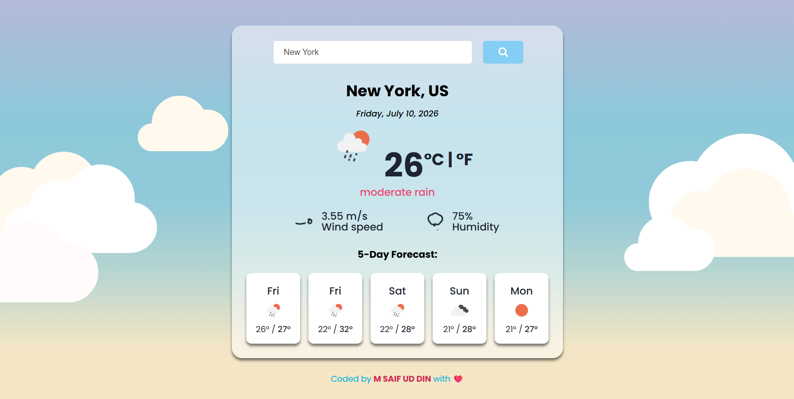

# 🌤️ React Weather Application

A modern, fully responsive weather dashboard built with React.js and Vite. This application allows users to search for real-time weather conditions anywhere in the world, featuring dynamic animated icons, a clean glassmorphism UI, and highly accurate 5-day forecasting.

**🔴 [View the Live Demo Here](https://your-netlify-link.netlify.app) 🔴**

 

## ✨ Features

* **Real-Time Data:** Instant access to current temperatures, humidity, and wind speed.
* **Advanced 5-Day Forecast:** Calculates true absolute minimum and maximum temperatures across 24-hour periods for accurate daily forecasting.
* **Dynamic Visuals:** * Integrates `react-animated-weather` for smooth, moving icons (wind, rain, etc.).
  * Automatically detects local daylight hours to display context-aware icons (e.g., hiding the moon during daytime forecasts).
* **Glassmorphism UI:** A modern, frosted-glass aesthetic built with pure CSS and a mobile-first Flexbox architecture.
* **Smart Search:** Pressing 'Enter' or clicking the search button instantly fetches updated data.

## 🛠️ Technologies & Tools

* **Frontend Framework:** React.js
* **Build Tool:** Vite
* **Styling:** CSS3 (Flexbox, Media Queries, Glassmorphism)
* **API Integration:** Axios
* **Weather Data:** OpenWeatherMap API
* **Icons:** React Animated Weather & FontAwesome

## 🚀 Installation and Setup

To get this project running on your local machine, follow these steps:

1. **Clone the repository:**
   ```bash
   git clone [https://github.com/MSaifUdDin-999/Weather_App.git](https://github.com/MSaifUdDin-999/Weather_App.git)

```

2. **Navigate to the project directory:**
```bash
cd Weather_App

```


3. **Install dependencies:**
```bash
npm install

```


4. **Configure the API Key:**
* Create a `.env` file in the root directory.
* Add your OpenWeatherMap API key like this:
```env
VITE_WEATHER_API_KEY=your_api_key_here

```


5. **Start the development server:**
```bash
npm run dev

```


6. **View the app:**
Open your browser and navigate to the `localhost` link provided in your terminal (usually `http://localhost:5173`).

## 🌍 Live Demo

Check out the live version of the application here: [Link to Live Demo] *(Note: Update this once you host it on Vercel or Netlify!)*

## 👨‍💻 Credits

Designed and developed by **Muhammad Saif Ud Din**.

## 📜 License

This project is open-source and available under the [MIT License](https://www.google.com/search?q=LICENSE).

---

## 🤝 Contact

Linkedin : **https://www.linkedin.com/in/muhammad-saif-ud-din-0b604840b/**

GitHub : **https://github.com/MSaifUdDin-999**

Email : **mrsaif1166@gmail.com**

*Developed with ❤️ by M SAIF UD DIN*